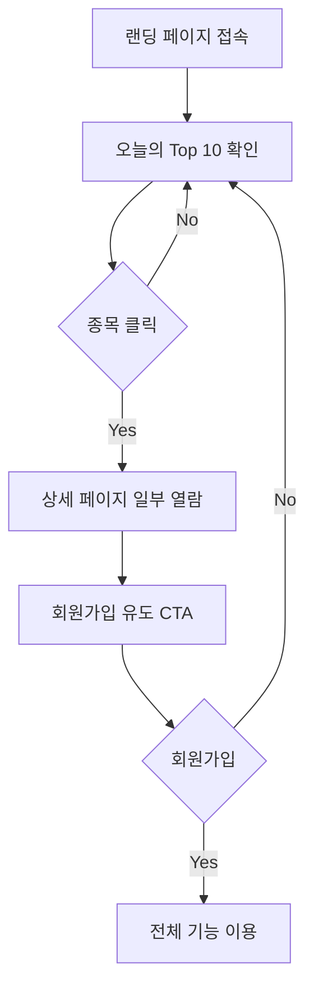
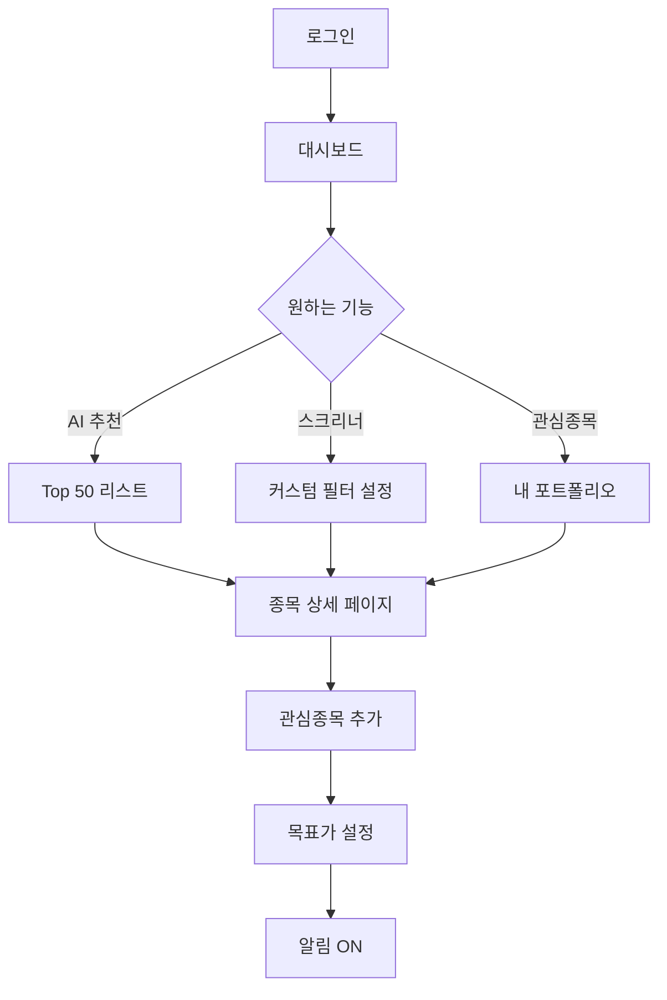
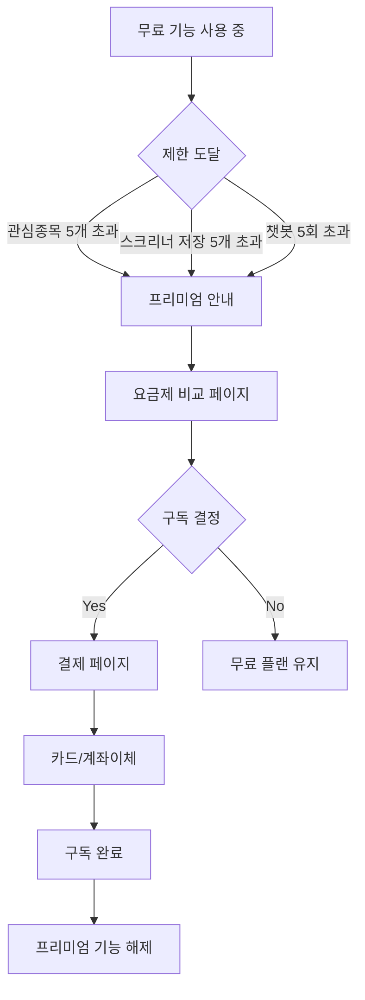

# Product Requirements Document (PRD)
# ValueHunt - AI 기반 저평가 우량주 발굴 서비스

**버전**: 1.0 (MVP)
**작성일**: 2026-01-13
**작성자**: Product Team
**문서 상태**: Draft for Development

---

## 📋 목차

1. [제품 개요](#1-제품-개요)
2. [시장 분석](#2-시장-분석)
3. [사용자 페르소나](#3-사용자-페르소나)
4. [제품 목표 및 성공 지표](#4-제품-목표-및-성공-지표)
5. [핵심 기능 명세](#5-핵심-기능-명세)
6. [사용자 플로우](#6-사용자-플로우)
7. [기술 요구사항](#7-기술-요구사항)
8. [UI/UX 가이드라인](#8-uiux-가이드라인)
9. [개발 로드맵](#9-개발-로드맵)
10. [리스크 및 제약사항](#10-리스크-및-제약사항)

---

## 1. 제품 개요

### 1.1 제품명
**ValueHunt (밸류헌트)**

### 1.2 제품 비전
> "AI가 재무제표를 분석하여, 저평가된 우량주를 찾아드립니다. 왜 그런지도 명확하게 설명합니다."

### 1.3 핵심 가치 제안
- **자동화된 가치 분석**: 수천 개 종목을 AI가 24시간 분석
- **투명한 근거**: 왜 이 종목이 저평가인지 명확한 설명 제공
- **초보자 친화적**: 복잡한 재무제표를 쉽게 이해할 수 있도록 시각화
- **가치투자 철학**: 단기 트레이딩이 아닌 장기 투자 관점

### 1.4 타겟 시장
- **Primary**: 한국 주식시장 (KOSPI, KOSDAQ)
- **Secondary**: 향후 미국 시장 확장 계획

### 1.5 경쟁 우위
| 항목 | ValueHunt | 기존 서비스 |
|------|-----------|------------|
| AI 분석 근거 | ✅ 투명하게 공개 | ❌ 블랙박스 |
| 가치투자 특화 | ✅ 장기 투자 관점 | ❌ 단기 트레이딩 중심 |
| 한국 시장 | ✅ KOSPI/KOSDAQ 최적화 | ⚠️ 글로벌 범용 |
| 중소형주 발굴 | ✅ 숨은 보석 발굴 | ⚠️ 대형주 중심 |

---

## 2. 시장 분석

### 2.1 시장 규모
- 한국 개인투자자: 약 1,400만 명 (2026년 기준)
- 온라인 증권 거래 비중: 95% 이상
- AI 투자 서비스 관심도: 93%가 지속 투자 의향

### 2.2 경쟁사 분석

#### 글로벌 서비스
| 서비스 | 강점 | 약점 | 가격 |
|--------|------|------|------|
| **Danelfin** | AI Score 정확도, 376% 수익률 | 한국 시장 미지원 | $39/월 |
| **TipRanks** | Smart Score, 월가 데이터 | 한국어 미지원 | $25/월 |
| **Seeking Alpha** | 펀더멘털 분석 강점 | 가격 높음 | $25~200/월 |

#### 한국 서비스
| 서비스 | 강점 | 약점 | 가격 |
|--------|------|------|------|
| **초이스스탁** | 20년 빅데이터, Smart Score | AI 완성도 낮음 | 무료 |
| **신한금융투자** | 개인화 추천 | 증권사 종속적 | 무료 |
| **키움증권** | 거래 연동 | AI 기능 제한적 | 무료 |

### 2.3 시장 기회 (Gap Analysis)
1. **한국+글로벌 수준의 AI**: 한국 시장 특화 + 글로벌 수준의 알고리즘
2. **투명한 AI 설명**: 왜 추천하는지 명확한 근거 제시
3. **가치투자 전문화**: 장기 투자자를 위한 서비스
4. **중소형주 강점**: 대형주 위주에서 벗어난 차별화

---

## 3. 사용자 페르소나

### Persona 1: 가치투자 초보자 "김투자" (30세, 회사원)
**배경**
- 투자 경험: 1년
- 투자 성향: 안정적 장기 투자 선호
- 고민: 재무제표를 어떻게 봐야 할지 모르겠음

**니즈**
- 저평가된 종목을 쉽게 찾고 싶다
- 전문가처럼 분석하고 싶지만 시간이 없다
- 왜 이 종목이 좋은지 명확한 근거가 필요하다

**사용 시나리오**
1. 출근길에 앱 열어서 "오늘의 Top 10" 확인
2. 마음에 드는 종목 2~3개 상세 페이지 열람
3. AI 분석 근거를 읽고 관심종목에 추가
4. 퇴근 후 재무제표 직접 확인하여 매수 결정

### Persona 2: 경험 있는 투자자 "박가치" (45세, 자영업)
**배경**
- 투자 경험: 10년+
- 투자 성향: 가치투자, 워렌 버핏 스타일
- 고민: 전 종목을 일일이 스크리닝하기 힘들다

**니즈**
- 자신만의 투자 기준으로 종목 필터링
- 놓치기 쉬운 중소형주 발굴
- 업종별 비교 데이터가 필요

**사용 시나리오**
1. 커스텀 스크리너에서 자신만의 조건 설정 (PER<10, ROE>12%, 부채비율<50%)
2. 결과 30개 종목을 엑셀로 다운로드
3. 동종업계 비교 데이터를 보며 심층 분석
4. 필터를 "My 피터린치 전략"으로 저장하여 매주 재사용

### Persona 3: 퇴직 준비자 "최배당" (55세, 직장인)
**배경**
- 투자 경험: 5년
- 투자 성향: 배당주 중심, 안정성 중시
- 고민: 고배당이면서 재무가 튼튼한 종목을 찾기 어렵다

**니즈**
- 배당수익률 3% 이상 종목
- 배당 지속 가능성 확인
- 재무 안정성 평가

**사용 시나리오**
1. 스크리너에서 "배당수익률 3% 이상" 필터 적용
2. 안정성 점수가 높은 종목 위주로 정렬
3. 3년 이상 배당 증가 종목만 선별
4. 포트폴리오에 담아서 분기마다 실적 추적

---

## 4. 제품 목표 및 성공 지표

### 4.1 비즈니스 목표
**3개월 (MVP 출시)**
- 회원가입: 500명
- DAU (Daily Active Users): 100명
- 평균 체류시간: 5분+

**6개월**
- 회원가입: 3,000명
- DAU: 500명
- 유료 전환율: 5%

**12개월**
- 회원가입: 10,000명
- MRR (Monthly Recurring Revenue): 10,000,000원
- NPS (Net Promoter Score): 50+

### 4.2 핵심 지표 (KPI)

#### Acquisition (유입)
- 주간 신규 가입자 수
- 랜딩 페이지 전환율
- 소셜 미디어 유입률

#### Activation (활성화)
- 첫 방문 시 종목 상세 페이지 조회율: 60%+
- 회원가입 후 관심종목 등록률: 30%+

#### Retention (재방문)
- Week 1 Retention: 30%+
- Week 4 Retention: 20%+
- 주간 재방문 횟수: 3회+

#### Revenue (수익)
- 유료 전환율: 5%+
- 평균 구독 기간: 6개월+
- Churn Rate: 10% 이하

#### Referral (추천)
- NPS: 40+
- 추천을 통한 가입: 20%+

### 4.3 PMF (Product-Market Fit) 검증 기준
- "이 서비스 없이는 투자하기 어렵다" 응답: 40%+
- Week 1 Retention: 30%+
- 유료 전환 의향: 20%+

---

## 5. 핵심 기능 명세

### 5.1 기능 우선순위

| 우선순위 | 기능 | 설명 | Phase |
|---------|------|------|-------|
| **P0** | AI 저평가 종목 스크리닝 | Value Score 기반 Top 50 추천 | MVP |
| **P0** | 종목 상세 분석 | AI 리포트 + 재무지표 시각화 | MVP |
| **P1** | 회원가입/로그인 | 소셜 로그인, 이메일 인증 | MVP |
| **P1** | 커스텀 스크리너 | 사용자 정의 필터링 | MVP |
| **P2** | 관심종목 추적 | 포트폴리오 모니터링 | MVP |
| **P2** | AI 챗봇 | 투자 Q&A, 용어 설명 | Phase 2 |
| **P3** | 이메일 알림 | 가격 도달, 실적 발표 알림 | Phase 2 |
| **P3** | 리밸런싱 제안 | 주기적 포트폴리오 점검 | Phase 2 |

---

### 5.2 기능별 상세 명세

#### 5.2.1 AI 저평가 종목 스크리닝 (P0)

**기능 설명**
전 종목을 AI가 자동 분석하여 Value Score를 산출하고, Top 50 종목을 추천합니다.

**Value Score 계산 방식**
```
Value Score = 밸류에이션(40%) + 수익성(30%) + 안정성(20%) + 배당(10%)

1. 밸류에이션 (40점)
   - PER (Price-to-Earnings Ratio): 업종 평균 대비 낮을수록 +점수
   - PBR (Price-to-Book Ratio): 1 이하 우대, 0.5 이하 고득점
   - PSR (Price-to-Sales Ratio): 낮을수록 +점수
   - EV/EBITDA: 기업가치 대비 수익성 평가

2. 수익성 (30점)
   - ROE (Return on Equity): 10% 이상 우대
   - ROA (Return on Assets): 일관된 수익 창출력
   - 영업이익률: 3년 평균 10% 이상
   - 순이익 증가율: YoY 성장세

3. 안정성 (20점)
   - 부채비율: 100% 이하 우대
   - 유동비율: 150% 이상
   - 이자보상배율: 3배 이상
   - 영업현금흐름: 3년 연속 양수

4. 배당/주주환원 (10점)
   - 배당수익률: 3% 이상 가점
   - 배당성향: 20~50% 적정
   - 배당 지속성: 3년 이상 연속 배당
```

**API 엔드포인트**
```
GET /api/v1/stocks/top-picks
Query Parameters:
  - market: KOSPI | KOSDAQ | ALL (default: ALL)
  - limit: 10~50 (default: 20)
  - category: valuation | profitability | stability | dividend

Response:
{
  "data": [
    {
      "rank": 1,
      "stock_code": "005930",
      "stock_name": "삼성전자",
      "market": "KOSPI",
      "current_price": 70000,
      "change_rate": -1.2,
      "value_score": 87.5,
      "category_scores": {
        "valuation": 92,
        "profitability": 85,
        "stability": 88,
        "dividend": 80
      },
      "key_metrics": {
        "PER": 8.5,
        "PBR": 0.9,
        "ROE": 12.3,
        "debt_ratio": 45.2,
        "dividend_yield": 3.2
      },
      "ai_summary": "업종 대비 낮은 PER과 안정적인 ROE를 보유하고 있으며, 재무구조가 탄탄합니다.",
      "upside_potential": "+35%"
    }
  ],
  "total_count": 50,
  "updated_at": "2026-01-13T07:00:00Z"
}
```

**비즈니스 룰**
- 데이터 업데이트: 매일 오전 7시 (장 시작 전)
- 비정상 종목 제외: 관리종목, 정리매매, 거래정지
- 최소 시가총액: 500억 원 이상 (페니스톡 제외)
- 최소 거래량: 일평균 10억 원 이상

**성공 기준**
- API 응답속도: 500ms 이하
- Top 50 종목의 3개월 평균 수익률: KOSPI 지수 +5%p 이상
- 사용자 만족도: "도움이 됐다" 80%+

---

#### 5.2.2 종목 상세 분석 페이지 (P0)

**기능 설명**
개별 종목의 상세 분석 리포트를 제공합니다.

**포함 정보**
1. **AI 종합 평가**
   - Value Score 시각화 (레이더 차트)
   - AI 한 줄 요약
   - 투자 포인트 3가지
   - 리스크 요인 2~3가지

2. **재무 지표 대시보드**
   - 최근 3년 주요 지표 추이 (라인 차트)
   - PER, PBR, ROE, 부채비율, 배당수익률
   - 업종 평균과 비교 (막대 그래프)

3. **동종업계 비교**
   - 같은 업종 상위 3개 기업과 비교
   - 테이블 형식

4. **투자 체크리스트**
   - 재무제표 보기 (DART 링크)
   - 최근 뉴스/공시 확인 (네이버 금융 링크)
   - 사업보고서 리스크 요인

**API 엔드포인트**
```
GET /api/v1/stocks/{stock_code}
Response:
{
  "stock_info": {
    "code": "005930",
    "name": "삼성전자",
    "market": "KOSPI",
    "sector": "반도체",
    "current_price": 70000,
    "market_cap": 4180000
  },
  "value_score": {
    "total": 87.5,
    "valuation": 92,
    "profitability": 85,
    "stability": 88,
    "dividend": 80
  },
  "ai_analysis": {
    "summary": "업종 대비 저평가 상태이며, 안정적인 수익성을 유지 중입니다.",
    "strengths": [
      "PER 8.5로 업종 평균(12.3) 대비 31% 저평가",
      "ROE 12.3%로 안정적인 수익성 유지",
      "3년 연속 배당 증가 (배당성장 기업)"
    ],
    "risks": [
      "최근 분기 영업이익 전년 대비 -15%",
      "업종 전체 성장률 둔화 추세"
    ]
  },
  "financial_metrics": {
    "historical": [...],  // 3년치 데이터
    "sector_comparison": {
      "sector_avg_PER": 12.3,
      "sector_avg_ROE": 10.5
    }
  },
  "peer_comparison": [
    {
      "name": "SK하이닉스",
      "PER": 9.2,
      "ROE": 11.8
    }
  ],
  "external_links": {
    "dart": "https://dart.fss.or.kr/...",
    "news": "https://finance.naver.com/..."
  }
}
```

**UI 요구사항**
- 모바일 반응형 디자인
- 차트 인터랙션 (호버 시 상세 수치 표시)
- 스크롤 시 헤더 고정 (종목명, 현재가)
- 관심종목 추가 버튼 (하트 아이콘)

**성공 기준**
- 페이지 로딩: 2초 이내
- 이탈률: 50% 이하
- 평균 체류시간: 3분+

---

#### 5.2.3 커스텀 스크리너 (P1)

**기능 설명**
사용자가 직접 조건을 설정하여 종목을 필터링합니다.

**필터 옵션**
```yaml
시장 구분:
  - KOSPI
  - KOSDAQ
  - 전체

시가총액:
  - 대형주 (5조 이상)
  - 중형주 (1천억~5조)
  - 소형주 (500억~1천억)
  - 전체

업종:
  - 제조업
  - IT/반도체
  - 금융
  - 바이오/헬스케어
  - 화학
  - 기타

밸류에이션:
  - PER: 슬라이더 (0~100)
  - PBR: 슬라이더 (0~10)
  - PSR: 슬라이더 (0~10)

수익성:
  - ROE 최소: 입력 필드 (%)
  - ROA 최소: 입력 필드 (%)
  - 영업이익률 최소: 입력 필드 (%)

안정성:
  - 부채비율 최대: 입력 필드 (%)
  - 유동비율 최소: 입력 필드 (%)

배당:
  - 배당수익률 최소: 입력 필드 (%)
  - 배당성향: 슬라이더 (0~100%)
```

**저장 기능**
- 필터 조합을 "My Strategy"로 저장
- 최대 5개까지 저장 (무료 사용자)
- 프리미엄 사용자: 10개
- 저장된 전략 이름 수정 가능

**API 엔드포인트**
```
POST /api/v1/screener
Body:
{
  "filters": {
    "market": ["KOSPI", "KOSDAQ"],
    "market_cap_min": 100000000000,
    "sector": ["반도체", "IT"],
    "PER_max": 10,
    "PBR_max": 1.0,
    "ROE_min": 12,
    "debt_ratio_max": 50,
    "dividend_yield_min": 2
  },
  "sort_by": "value_score",
  "order": "desc",
  "limit": 50
}

Response:
{
  "results": [...],  // 종목 리스트
  "total_count": 32,
  "filters_applied": {...}
}
```

**비즈니스 룰**
- 필터 조합 저장: 로그인 필수
- 결과 엑셀 다운로드: 프리미엄 사용자만
- 최대 결과 수: 100개

**성공 기준**
- 필터 저장률: 30%+
- 저장된 필터 재사용률: 50%+

---

#### 5.2.4 관심종목 추적 (P2)

**기능 설명**
관심 종목을 담아서 지속적으로 모니터링합니다.

**기능 상세**
- 관심종목 추가: 최대 20개 (무료), 50개 (프리미엄)
- 가격 알림: 목표가 도달 시 이메일/푸시 알림
- Value Score 변화 추적: 점수 변동 내역 저장
- 포트폴리오 차트: 관심종목의 수익률 시뮬레이션

**API 엔드포인트**
```
GET /api/v1/watchlist
Response:
{
  "watchlist": [
    {
      "stock_code": "005930",
      "stock_name": "삼성전자",
      "added_at": "2026-01-10",
      "target_price": 75000,
      "current_price": 70000,
      "value_score_change": "+3.5",
      "alert_enabled": true
    }
  ]
}

POST /api/v1/watchlist
Body:
{
  "stock_code": "005930",
  "target_price": 75000,
  "alert_enabled": true
}

DELETE /api/v1/watchlist/{stock_code}
```

**알림 조건**
- 목표가 도달: 현재가 >= 목표가
- Value Score 급등: +10점 이상 변화
- 실적 발표: 분기 실적 발표일
- 중요 공시: 배당, 유상증자 등

**성공 기준**
- 관심종목 등록률: 30%+
- 주간 관심종목 확인 횟수: 3회+

---

#### 5.2.5 AI 챗봇 도우미 (P2)

**기능 설명**
투자 관련 질문에 AI가 답변합니다.

**지원 기능**
1. **용어 설명**
   - "ROE가 뭔가요?"
   - "PER과 PBR의 차이는?"

2. **종목 질문**
   - "삼성전자는 왜 저평가인가요?"
   - "현대차의 재무 상태는 어떤가요?"

3. **스크리닝 요청**
   - "중소형주 중에서 추천해주세요"
   - "배당주 찾아줘"

**기술 스펙**
- AI 모델: Anthropic Claude Sonnet
- 컨텍스트: 최근 5회 대화 + ValueHunt 데이터베이스
- 응답 속도: 3초 이내

**API 엔드포인트**
```
POST /api/v1/chat
Body:
{
  "message": "ROE가 뭔가요?",
  "conversation_id": "uuid"
}

Response:
{
  "reply": "ROE(자기자본이익률)는 기업이 주주의 돈을 얼마나 효율적으로 사용해서 이익을 냈는지 보여주는 지표입니다. 일반적으로 10% 이상이면 우량하다고 평가합니다.",
  "conversation_id": "uuid",
  "related_links": [
    {
      "title": "ROE 높은 종목 보기",
      "url": "/screener?ROE_min=10"
    }
  ]
}
```

**제약사항**
- 무료 사용자: 일 5회
- 프리미엄 사용자: 무제한
- 투자 자문 금지: 법적 문제 회피

**성공 기준**
- 챗봇 사용률: 20%+
- 답변 만족도: 70%+

---

## 6. 사용자 플로우

### 6.1 첫 방문자 플로우 (익명)


### 6.2 회원 사용자 플로우


### 6.3 프리미엄 전환 플로우


---

## 7. 기술 요구사항

### 7.1 시스템 아키텍처

```
┌─────────────┐
│   Client    │ (React, TypeScript)
│  (Vercel)   │
└─────┬───────┘
      │ HTTPS
┌─────▼───────┐
│  API Gateway│
│  (FastAPI)  │
└─────┬───────┘
      │
┌─────┴───────┬───────────┬──────────┐
│             │           │          │
▼             ▼           ▼          ▼
┌──────┐  ┌──────┐  ┌──────┐  ┌──────┐
│Auth  │  │Stock │  │AI    │  │Alert │
│Service│  │Service│  │Service│  │Service│
└──┬───┘  └──┬───┘  └──┬───┘  └──┬───┘
   │         │         │         │
   └─────────┴─────────┴─────────┘
             │
   ┌─────────┴─────────┐
   │                   │
   ▼                   ▼
┌──────┐          ┌──────┐
│PostgreSQL│      │Redis │
│(Primary)│      │(Cache)│
└──────┘          └──────┘
   │
   ▼
┌──────┐
│Celery│ (Background Jobs)
│Worker│
└──────┘
```

### 7.2 기술 스택

#### Frontend
```yaml
언어: TypeScript 5.0+
프레임워크: React 18
빌드 도구: Vite
상태관리: Zustand
UI 라이브러리:
  - Tailwind CSS
  - shadcn/ui
  - Radix UI
차트: Recharts
폼: React Hook Form + Zod
HTTP 클라이언트: Axios
인증: NextAuth.js
```

#### Backend
```yaml
언어: Python 3.11+
프레임워크: FastAPI 0.100+
ORM: SQLAlchemy 2.0
마이그레이션: Alembic
인증: JWT (PyJWT)
비밀번호 해싱: bcrypt
API 문서: OpenAPI (Swagger)
```

#### Database
```yaml
Primary DB: PostgreSQL 15+
  - 재무 데이터
  - 사용자 정보
  - 관심종목

Cache: Redis 7+
  - 세션
  - Top 50 리스트
  - API 응답 캐싱

Time-series: TimescaleDB (optional)
  - 주가 이력 데이터
```

#### AI/ML
```yaml
AI API:
  - OpenAI GPT-4 (리포트 생성)
  - Anthropic Claude Sonnet (챗봇)

ML Framework:
  - scikit-learn (전처리)
  - XGBoost or LightGBM (Value Score 모델)
  - pandas, numpy (데이터 처리)
```

#### Infrastructure
```yaml
Hosting:
  - Frontend: Vercel
  - Backend: AWS EC2 or Railway
  - DB: AWS RDS (PostgreSQL)
  - Cache: AWS ElastiCache (Redis)

CI/CD:
  - GitHub Actions
  - Docker

Monitoring:
  - Sentry (에러 추적)
  - Google Analytics (사용자 행동)
  - Prometheus + Grafana (서버 모니터링)

Logging:
  - ELK Stack (Elasticsearch, Logstash, Kibana)
```

### 7.3 데이터 소스

#### 한국 주식 데이터
```yaml
1차 소스: FinanceDataReader
  - 주가 데이터 (OHLCV)
  - 재무제표
  - 시가총액

2차 소스: pykrx
  - KRX 공식 데이터
  - 실시간성 높음

보조 소스:
  - DART API: 전자공시
  - 네이버 금융: 뉴스, 투자의견
  - 한국은행 API: 금리, 환율
```

#### 데이터 수집 스케줄
```yaml
Daily (매일 오전 6시):
  - 전종목 주가 수집
  - 재무제표 업데이트 (분기)
  - 공시 정보 수집

Daily (매일 오전 7시):
  - Value Score 재계산
  - Top 50 리스트 갱신
  - 캐시 업데이트

Weekly (매주 월요일):
  - 포트폴리오 리밸런싱 제안
  - 주간 리포트 이메일 발송

Quarterly (분기별):
  - ML 모델 재학습
  - 백테스팅 성능 검증
```

### 7.4 보안 요구사항

```yaml
인증:
  - JWT 토큰 기반 인증
  - Access Token: 1시간
  - Refresh Token: 7일
  - HTTP-only Cookie

비밀번호:
  - bcrypt 해싱
  - 최소 8자, 영문+숫자+특수문자

API 보안:
  - HTTPS 강제
  - Rate Limiting (분당 100회)
  - CORS 설정
  - SQL Injection 방어 (ORM 사용)
  - XSS 방어 (입력 검증)

데이터 보안:
  - 개인정보 암호화 (AES-256)
  - 결제 정보는 저장하지 않음 (PG사 처리)
  - GDPR/개인정보보호법 준수
```

### 7.5 성능 요구사항

```yaml
API 응답속도:
  - /stocks/top-picks: 500ms 이하
  - /stocks/{code}: 1000ms 이하
  - /screener: 2000ms 이하

페이지 로딩:
  - First Contentful Paint: 1.5초 이하
  - Time to Interactive: 3초 이하

동시 접속:
  - 동시 사용자: 500명 처리 가능
  - TPS (Transactions per Second): 100+

가용성:
  - Uptime: 99.5% 이상
  - 에러율: 1% 이하
```

---

## 8. UI/UX 가이드라인

### 8.1 디자인 원칙

**1. 명확성 (Clarity)**
- 전문 용어는 툴팁으로 설명 제공
- 중요한 정보는 시각적으로 강조
- 액션 버튼은 명확한 라벨 사용

**2. 일관성 (Consistency)**
- 색상, 타이포그래피, 컴포넌트 일관성 유지
- 버튼 위치 및 동작 패턴 통일

**3. 효율성 (Efficiency)**
- 3클릭 내 모든 기능 접근
- 자주 쓰는 기능은 빠른 접근 제공
- 로딩 상태 명확히 표시

**4. 신뢰성 (Trust)**
- 데이터 출처 명시
- AI 분석 근거 투명하게 공개
- 면책조항 명확히 표시

### 8.2 컬러 팔레트

```yaml
Primary (브랜드 컬러):
  - Blue-600: #2563EB (주요 버튼, 링크)
  - Blue-700: #1D4ED8 (호버 상태)

Secondary:
  - Gray-700: #374151 (본문 텍스트)
  - Gray-500: #6B7280 (보조 텍스트)
  - Gray-100: #F3F4F6 (배경)

Semantic Colors:
  - Green-500: #10B981 (상승, 긍정)
  - Red-500: #EF4444 (하락, 리스크)
  - Yellow-500: #F59E0B (경고)
  - Purple-500: #8B5CF6 (프리미엄)

Background:
  - White: #FFFFFF (카드, 모달)
  - Gray-50: #F9FAFB (전체 배경)
```

### 8.3 타이포그래피

```yaml
폰트 패밀리:
  - 한글: Pretendard Variable
  - 영문/숫자: Inter

폰트 크기:
  - Display: 48px (랜딩 히어로)
  - H1: 32px (페이지 제목)
  - H2: 24px (섹션 제목)
  - H3: 20px (카드 제목)
  - Body: 16px (본문)
  - Small: 14px (캡션, 보조)
  - Tiny: 12px (레이블)

폰트 굵기:
  - Bold: 700 (제목, 강조)
  - Semibold: 600 (서브 제목)
  - Regular: 400 (본문)
```

### 8.4 주요 컴포넌트

#### 8.4.1 종목 카드
```
┌──────────────────────────┐
│ 1. 삼성전자 (005930)      │ ← H3, Bold
│ Value Score: 87 ████████░│ ← Progress Bar
│ 현재가: 70,000원 (-1.2%) │ ← Body, Red
│ PER 8.5 | PBR 0.9         │ ← Small, Gray
│ "업종 대비 31% 저평가"    │ ← Small, Italic
│ [♡ 관심] [상세보기 →]    │ ← Buttons
└──────────────────────────┘
```

**스펙**
- 너비: 고정 320px (데스크톱), 100% (모바일)
- 높이: 자동 (min-height: 180px)
- 패딩: 16px
- 보더: 1px solid Gray-200
- 보더 라운드: 8px
- 그림자: Shadow-sm (호버 시 Shadow-md)
- 호버 효과: transform scale(1.02), transition 200ms

#### 8.4.2 Value Score 레이더 차트
```
     밸류에이션(92)
        /  \
  수익성 ── 안정성
   (85)      (88)
        \  /
      배당(80)
```

**스펙**
- 크기: 300x300px
- 축: 4개 (밸류에이션, 수익성, 안정성, 배당)
- 색상: Blue-500 (fill: opacity 0.2)
- 점수 표시: 각 축 끝에 숫자 라벨
- 인터랙션: 호버 시 점수 강조

#### 8.4.3 필터 슬라이더
```
PER: [0]━━━━●━━━━[50]
         ↑
        8.5
```

**스펙**
- Track: Gray-200
- Filled Track: Blue-500
- Thumb: Blue-600, 크기 16px
- 라벨: 위에 현재 값 표시
- 스텝: 0.1

### 8.5 반응형 브레이크포인트

```yaml
Mobile: 320px ~ 767px
  - 1단 레이아웃
  - 네비게이션: 하단 탭 바

Tablet: 768px ~ 1023px
  - 2단 그리드
  - 네비게이션: 상단 헤더

Desktop: 1024px+
  - 3단 그리드
  - 네비게이션: 상단 헤더 + 사이드바
```

### 8.6 인터랙션 가이드

```yaml
버튼:
  - Primary: Blue-600 → Blue-700 (호버)
  - Secondary: Gray-200 → Gray-300 (호버)
  - Disabled: Gray-300, cursor: not-allowed

링크:
  - Color: Blue-600
  - Underline: 호버 시만
  - Visited: Purple-600

로딩:
  - 스피너: Tailwind animate-spin
  - 스켈레톤: Gray-200 → Gray-300 애니메이션

토스트 알림:
  - Success: Green-500 배경
  - Error: Red-500 배경
  - Warning: Yellow-500 배경
  - 위치: 화면 우상단
  - 지속시간: 3초
```

---

## 9. 개발 로드맵

### 9.1 Phase 1: 기초 인프라 (Week 1-3)

**Week 1-2: 데이터 파이프라인 구축**
- [ ] FinanceDataReader 연동 및 테스트
- [ ] PostgreSQL 스키마 설계
  - stocks 테이블 (종목 정보)
  - financial_metrics 테이블 (재무 지표)
  - value_scores 테이블 (Value Score 이력)
  - users 테이블
  - watchlist 테이블
- [ ] Celery 스케줄러 설정
- [ ] 일간 데이터 수집 자동화 (매일 오전 6시)
- [ ] 30개 재무지표 계산 로직 구현

**Week 3: Backend API 기본 구조**
- [ ] FastAPI 프로젝트 세팅
- [ ] `/stocks/top-picks` 엔드포인트
- [ ] `/stocks/{code}` 상세 조회
- [ ] Redis 캐싱 레이어 구현
- [ ] API 문서 자동 생성 (Swagger)
- [ ] 유닛 테스트 작성 (커버리지 80%+)

**산출물**
- 데이터베이스 ERD
- API 명세서 (OpenAPI 3.0)
- 데이터 수집 스크립트

---

### 9.2 Phase 2: AI 분석 엔진 (Week 4-6)

**Week 4-5: Value Score 모델 개발**
- [ ] 4개 카테고리 점수 계산 알고리즘 구현
- [ ] 업종별 정규화 로직 개발
- [ ] 과거 3년 데이터로 백테스팅
- [ ] 모델 성능 검증
  - Sharpe Ratio 계산
  - KOSPI 대비 초과 수익률 측정
- [ ] A/B 테스트용 버전 관리

**Week 6: AI 리포트 생성**
- [ ] OpenAI GPT-4 API 연동
- [ ] 프롬프트 엔지니어링
  - 시스템 프롬프트 작성
  - Few-shot 예시 준비
- [ ] "AI 한 줄 평가" 자동 생성
- [ ] 투자 포인트/리스크 요인 추출
- [ ] 생성 속도 최적화 (3초 이내)

**산출물**
- Value Score 알고리즘 문서
- AI 프롬프트 템플릿
- 백테스팅 리포트

---

### 9.3 Phase 3: 프론트엔드 MVP (Week 7-9)

**Week 7: 핵심 화면 개발**
- [ ] 프로젝트 세팅 (Vite + React + TypeScript)
- [ ] 디자인 시스템 구축 (Tailwind + shadcn/ui)
- [ ] 랜딩 페이지
  - 히어로 섹션
  - 오늘의 Top 10 미리보기
  - CTA (회원가입 유도)
- [ ] AI 추천 페이지
  - 종목 리스트 (카드 형식)
  - 검색/필터/정렬
- [ ] 종목 상세 페이지
  - Value Score 시각화
  - AI 분석 리포트
  - 재무지표 차트

**Week 8: 인터랙션 구현**
- [ ] 검색 자동완성
- [ ] 필터 적용 및 리셋
- [ ] 차트 인터랙션 (Recharts)
- [ ] 반응형 디자인 구현
  - 모바일 네비게이션
  - 타블렛 레이아웃
- [ ] 로딩 상태 처리 (스켈레톤 UI)
- [ ] 에러 바운더리

**Week 9: 회원 기능**
- [ ] 회원가입/로그인 UI
  - 이메일 + 비밀번호
  - Google OAuth
  - Kakao OAuth
- [ ] 로그인 상태 관리 (Zustand)
- [ ] 관심종목 추가/삭제
- [ ] 마이페이지
  - 프로필 편집
  - 구독 정보

**산출물**
- Figma 디자인 시스템
- 컴포넌트 스토리북
- E2E 테스트 (Playwright)

---

### 9.4 Phase 4: 추가 기능 (Week 10-11)

**Week 10: 커스텀 스크리너**
- [ ] 필터 UI 구현
  - 슬라이더 컴포넌트
  - 입력 필드 검증
- [ ] 실시간 필터링 로직
- [ ] 필터 저장/불러오기
- [ ] 결과 엑셀 다운로드 (xlsx.js)

**Week 11: AI 챗봇 (간소화 버전)**
- [ ] Anthropic Claude API 연동
- [ ] 채팅 UI 구현
  - 메시지 입력창
  - 대화 이력 표시
- [ ] 기본 Q&A
  - 용어 설명
  - 종목 질문
- [ ] 종목 검색 연동
- [ ] 사용 횟수 제한 (무료: 5회/일)

**산출물**
- 스크리너 사용 가이드
- 챗봇 프롬프트 템플릿

---

### 9.5 Phase 5: 테스트 & 배포 (Week 12)

**Week 12: QA & 런칭 준비**
- [ ] 통합 테스트
  - API 엔드포인트 전체 테스트
  - 프론트엔드 E2E 테스트
- [ ] 버그 수정 (Critical/High 우선)
- [ ] 성능 최적화
  - 이미지 최적화 (WebP)
  - 코드 스플리팅
  - 번들 크기 최소화
- [ ] SEO 설정
  - 메타 태그
  - Open Graph
  - Sitemap
  - robots.txt
- [ ] 프로덕션 배포
  - Frontend: Vercel
  - Backend: Railway/AWS
  - DB: AWS RDS
- [ ] 모니터링 설정
  - Sentry
  - Google Analytics
- [ ] 베타 테스터 모집 (50명)
- [ ] 피드백 수집 및 분석

**산출물**
- 테스트 리포트
- 배포 가이드
- 운영 매뉴얼

---

### 9.6 마일스톤

| Week | 마일스톤 | 산출물 |
|------|---------|--------|
| W3 | 데이터 파이프라인 완성 | API 명세서, ERD |
| W6 | AI 분석 엔진 완성 | Value Score 알고리즘 |
| W9 | MVP Frontend 완성 | 디자인 시스템, E2E 테스트 |
| W11 | 모든 핵심 기능 완성 | 통합 테스트 리포트 |
| W12 | **MVP 출시** | 운영 매뉴얼 |

---

## 10. 리스크 및 제약사항

### 10.1 기술적 리스크

| 리스크 | 영향도 | 발생 확률 | 완화 전략 |
|-------|--------|----------|----------|
| **데이터 품질 이슈** | 🔴 High | Medium | • 다중 소스 크로스체크<br>• 이상치 탐지 알고리즘<br>• 수동 검증 프로세스 |
| **AI 분석 부정확성** | 🔴 High | Medium | • 백테스팅 검증<br>• 면책조항 명시<br>• 사용자 피드백 수집 |
| **API 호출 비용** | 🟡 Mid | High | • 적극적인 캐싱<br>• 무료 티어 최대 활용<br>• 요청 배칭 |
| **스케일링 한계** | 🟢 Low | Low | • 수평 확장 설계<br>• 로드 밸런싱<br>• DB 샤딩 준비 |
| **데이터 수집 실패** | 🟡 Mid | Medium | • 재시도 로직<br>• 다중 소스 폴백<br>• 알림 시스템 |

### 10.2 비즈니스 리스크

| 리스크 | 영향도 | 발생 확률 | 완화 전략 |
|-------|--------|----------|----------|
| **법적 이슈 (투자자문)** | 🔴 High | Low | • "투자 참고용" 명시<br>• 약관에 면책조항<br>• 법률 자문 |
| **경쟁사 모방** | 🟡 Mid | High | • 빠른 실행<br>• 커뮤니티 구축<br>• 브랜드 차별화 |
| **시장 수요 부족** | 🔴 High | Medium | • 베타 테스트로 PMF 검증<br>• 빠른 피벗<br>• 사용자 인터뷰 |
| **수익화 어려움** | 🟡 Mid | Medium | • Freemium 모델<br>• 명확한 가치 제공<br>• 유료 기능 차별화 |

### 10.3 운영 리스크

| 리스크 | 영향도 | 발생 확률 | 완화 전략 |
|-------|--------|----------|----------|
| **서버 다운타임** | 🟡 Mid | Medium | • 헬스체크 모니터링<br>• 자동 재시작<br>• 백업 시스템 |
| **보안 침해** | 🔴 High | Low | • 정기 보안 점검<br>• 침투 테스트<br>• Bug Bounty 프로그램 |
| **고객 지원 부담** | 🟢 Low | High | • FAQ/도움말 충실<br>• AI 챗봇 활용<br>• 커뮤니티 포럼 |

### 10.4 제약사항

**기술적 제약**
- OpenAI API Rate Limit: 분당 3,500 requests (Tier 4)
- PostgreSQL 동시 접속: 최대 100 connections
- Redis 메모리: 초기 1GB (필요 시 확장)

**비즈니스 제약**
- 초기 예산: 개발 3개월, 운영 비용 월 $500
- 팀 규모: 1명 (풀스택) → 초기 자동화 필수
- 마케팅 예산: 없음 (SEO, SNS 중심)

**법적 제약**
- 투자자문업 면허 없음 → 자문 불가, 정보 제공만 가능
- 개인정보보호법 준수 필수
- 금융정보 제공 시 출처 명시 의무

---

## 11. 부록

### 11.1 용어집

| 용어 | 설명 |
|------|------|
| **Value Score** | ValueHunt의 독자적인 종목 평가 점수 (0~100점) |
| **PER** | Price-to-Earnings Ratio, 주가수익비율 |
| **PBR** | Price-to-Book Ratio, 주가순자산비율 |
| **ROE** | Return on Equity, 자기자본이익률 |
| **ROA** | Return on Assets, 총자산이익률 |
| **PSR** | Price-to-Sales Ratio, 주가매출비율 |
| **EV/EBITDA** | Enterprise Value / Earnings Before Interest, Taxes, Depreciation, and Amortization |

### 11.2 참고 자료

**데이터 소스**
- [FinanceDataReader GitHub](https://github.com/FinanceData/FinanceDataReader)
- [pykrx GitHub](https://github.com/sharebook-kr/pykrx)
- [DART 전자공시](https://dart.fss.or.kr/)
- [KRX 정보데이터시스템](https://data.krx.co.kr/)

**경쟁사 분석**
- [Danelfin](https://danelfin.com)
- [TipRanks](https://www.tipranks.com)
- [Seeking Alpha](https://seekingalpha.com)
- [초이스스탁](https://www.choicestock.co.kr/)

**기술 문서**
- [FastAPI 공식 문서](https://fastapi.tiangolo.com/)
- [React 공식 문서](https://react.dev/)
- [Tailwind CSS](https://tailwindcss.com/)
- [OpenAI API](https://platform.openai.com/docs)

### 11.3 변경 이력

| 버전 | 날짜 | 변경 내용 | 작성자 |
|------|------|----------|--------|
| 1.0 | 2026-01-13 | 초안 작성 | Product Team |

---

## 문서 승인

| 역할 | 이름 | 서명 | 날짜 |
|------|------|------|------|
| Product Manager | | | |
| Tech Lead | | | |
| Designer | | | |
| Stakeholder | | | |

---

**문서 끝**
